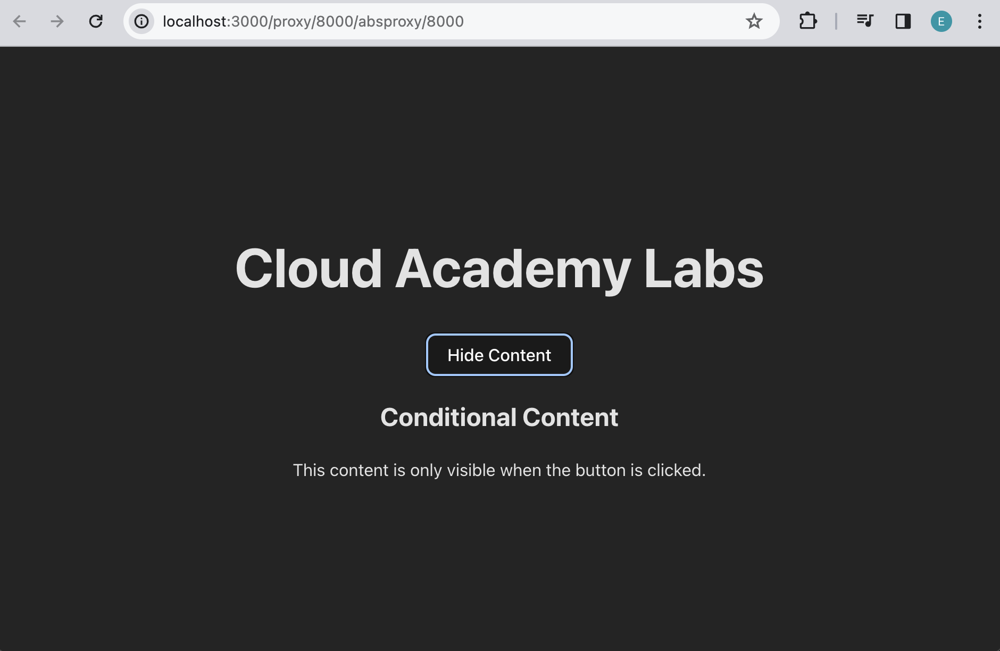

# React - Introduction to Conditional Rendering

## Setup 
Before we begin writing code, let's setup the project and install all necesarry packages.
Open a new Terminal window and do the following steps:

1. Go to `calab` directory:
    ```
    cd calab
    ```
2. Install npm packages:
    ```
    npm install
    ```
3. Start the application:
    ```
    npm run dev
    ```
    You should see the development server being started:
    []() 

    If you open the `Local` URL in a new browser tab, you should see the follwoing:
    []()    


## Steps 

1. Import Use State from React
    -   Open `src/App.jsx`.
    -   Just above App function import `useState` from `React`.
        ```JSX
        import React, { useState } from 'react';
        ```


2. Declare State Variables
    -   Inside App function, using a destructured array syntax add `isVisible` variable representing state as the first element and `setIsVisible` as a second element representing a name of the method that will set that state, set login status. 
    -   Set this array equal to `useState`, and as an argument, pass in a default value of `false`.
        ```JSX
        const [isVisible, setIsVisible] = useState(false);
        ```
3. Create Button to change `isVisible` state.
    -   Create event handler function named `handleClick`, right below the state. 
        ```JSX
        const handleClick = () => {
            setIsVisible(!isVisible)
        }
        ```
    -   Inside of the components return statement just below the `<h1>` element, add a button element.
    -   On the button type onClick to bind the click event created above and set it equal to `handleClick`. 
    -   Use ternary operator to display different text inside the button based on a `isVisible` state.
        ```JSX
        <button onClick={() => handleClick()}>
            {isVisible ? 'Hide Content' : 'Show Content'}
        </button>
        ```

4. Conditionaly render text based on `isVisible` state.
    -    Inside of the components return statement just below the `<button>` element, type curly braces, and inside of the curly braces, use the ternary operator to display different jsx elements based on `isVisible` status. 
            ```JSX
            {/* Conditional rendering based on state */}
            {isVisible && (
                <div>
                <h2>Conditional Content</h2>
                <p>This content is only visible when the button is clicked.</p>
                </div>
            )}
            ```

If you followed the steps correctly you should see the following when you run your react application:
[]() 
[]()   

